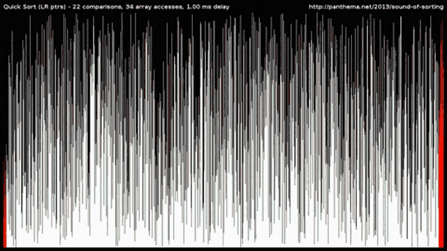

# push_swap
 
This project is the 6th of the 42 School cursus.

# Description
In this project, we must implement a program taking a list of integers as arguments,
and output a list of instructions to sort the list using two pseudo stacks,
with a limited set of instructions, and the smallest number of moves possible. 
The available instructions are as followed: 
- sa : swap a - swap the first 2 elements at the top of stack a. Do nothing if there is only one or no elements). 
- sb : swap b - swap the first 2 elements at the top of stack b. Do nothing if there is only one or no elements). 
- ss : sa and sb at the same time. 
- pa : push a - take the first element at the top of b and put it at the top of a. Do nothing if b is empty. 
- pb : push b - take the first element at the top of a and put it at the top of b. Do nothing if a is empty. 
- ra : rotate a - shift up all elements of stack a by 1. The first element becomes the last one. 
- rb : rotate b - shift up all elements of stack b by 1. The first element becomes the last one. 
- rr : ra and rb at the same time. 
- rra : reverse rotate a - shift down all elements of stack a by 1. The last element becomes the first one. 
- rrb : reverse rotate b - shift down all elements of stack b by 1. The last element becomes the first one. 
- rrr : rra and rrb at the same time. 
